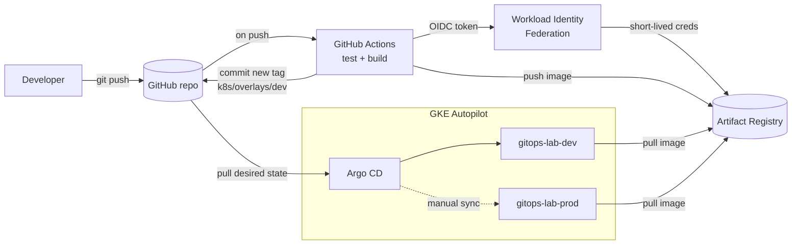

# GKE GitOps Lab

A hands-on training lab for DevOps consultants who already know AWS and Azure and need to become productive on Google Cloud. Trainees build a real delivery pipeline end to end:

**GitHub Actions** builds and tests two services, pushes images to **Artifact Registry** using keyless auth, and writes the new image tag back to Git. **Argo CD** watches Git and deploys to **GKE Autopilot**. Nothing in CI ever runs `kubectl`.



## What's in the box

| Path | Purpose |
|---|---|
| `infra/terraform/` | VPC, GKE Autopilot, Artifact Registry, least-privilege node SA, Workload Identity Federation for GitHub |
| `apps/backend/` | FastAPI service that reports its version and pod name, with unit tests |
| `apps/frontend/` | nginx static UI that proxies `/api` to the backend and visualises which pod answered each request |
| `k8s/base`, `k8s/overlays/{dev,prod}` | Kustomize manifests: probes, HPA, non-root security context, per-environment config |
| `argocd/bootstrap/root-app.yaml` | App-of-apps, the only thing applied by hand |
| `argocd/apps/` | AppProject guardrails plus dev (auto-sync) and prod (manual sync) Applications |
| `.github/workflows/` | Per-service CI, a reusable build-push-update workflow, and a promote-to-prod PR workflow |
| `scripts/` | Numbered scripts that match the lab modules, plus teardown |
| `docs/LAB_GUIDE.md` | Step-by-step trainee guide with checkpoints and exercises |
| `docs/PRESENTER_GUIDE.md` | Agenda, talking points, live demo script, troubleshooting |

## AWS / Azure / GCP cheat sheet

| Concept | AWS | Azure | GCP (this lab) |
|---|---|---|---|
| Isolation and billing boundary | Account | Subscription / resource group | Project |
| Managed Kubernetes | EKS | AKS | GKE |
| "No node management" mode | EKS Auto Mode / Fargate | AKS Automatic | GKE Autopilot |
| Container registry | ECR | ACR | Artifact Registry |
| CI federation, no keys | IAM OIDC provider + role | Entra federated credential | Workload Identity Federation + service account |
| Pod-to-cloud identity | IRSA / EKS Pod Identity | Entra Workload ID | GKE Workload Identity Federation |
| Network | Regional VPC | Regional VNet | **Global** VPC, regional subnets |
| CLI profiles | `aws --profile` | `az account set` | `gcloud config configurations` |
| Native IaC | CloudFormation | Bicep / ARM | Infrastructure Manager (Terraform) |

## Quick start (trainer dry run, about 45 minutes)

Prerequisites: a GCP project with billing, a GitHub repo you own, and `gcloud`, `terraform` ≥ 1.5, `kubectl`, `docker`, `git`. `gh` and the `argocd` CLI are optional.

```bash
# 0. Push this code to your own GitHub repo (public keeps Argo CD setup simplest)
gcloud auth login && gcloud auth application-default login
gcloud config set project YOUR_PROJECT_ID
./scripts/00-check-prereqs.sh

# 1. Optional local run
docker compose up --build            # http://localhost:8080

# 2. Infrastructure
cp infra/terraform/terraform.tfvars.example infra/terraform/terraform.tfvars   # edit it
./scripts/01-provision-infra.sh

# 3. Wire the repo, then commit, push, and run both workflows once
./scripts/02-configure-repo.sh

# 4. GitOps
./scripts/03-install-argocd.sh

# Clean up when done
./scripts/99-teardown.sh
```

If your repo is **private**, register it with Argo CD before step 4 (`argocd repo add https://github.com/ORG/REPO.git --username x --password <fine-grained PAT with read access>`), or add a repository Secret as described in the Argo CD docs.

## Verify the deployment

```bash
# Argo CD components and Applications (dev: Synced/Healthy; prod: OutOfSync until you sync it by hand)
kubectl -n argocd get pods
kubectl -n argocd get applications

# Force Argo CD to re-read Git now instead of waiting up to ~3 minutes
kubectl -n argocd annotate application root argocd.argoproj.io/refresh=hard --overwrite

# Dev app: pods, and the public IP of the frontend LoadBalancer
kubectl -n gitops-lab-dev get pods,svc
kubectl -n gitops-lab-dev get svc frontend -w
curl http://EXTERNAL_IP/api/info          # reports the deployed version and pod name

# Argo CD UI at https://localhost:8443 (user: admin, password printed by 03-install-argocd.sh)
kubectl -n argocd port-forward svc/argocd-server 8443:443

# Self-heal demo: change the cluster by hand, then watch Argo CD revert it to what Git says
kubectl -n gitops-lab-dev scale deploy/frontend --replicas=5
kubectl -n gitops-lab-dev get deploy frontend
```

To promote to prod, run the **promote-to-prod** workflow, merge the PR it opens, then click **Sync** on `gitops-lab-prod` in Argo CD.

CI commits new image tags to `main`, so run `git pull` before making local changes.

If `kubectl` fails with `gke-gcloud-auth-plugin not found`, run `gcloud components install gke-gcloud-auth-plugin`. With Homebrew's gcloud, also put it on your PATH: `ln -s "$(gcloud info --format='value(installation.sdk_root)')/bin/gke-gcloud-auth-plugin" /opt/homebrew/bin/`.

## Design choices worth discussing in class

**Monorepo for app and config.** Easier to teach in one repo. In production most teams split application code from the GitOps config repo so that CI write access and deploy history are separated; that split is a stretch exercise.

**CI writes to Git, not to the cluster.** The cluster has no inbound credentials from CI. Rollback is `git revert`. Audit history is `git log`.

**Keyless CI.** No service account JSON keys exist. The trust is scoped to one GitHub repository by an attribute condition.

**HPA owns replicas.** The backend Deployment omits `replicas` so Argo CD self-heal and the HPA don't fight.

**Two promotion gates.** A PR to change prod tags, then a manual sync in Argo CD.

## Cost note

GKE Autopilot bills for the resources your pods request, plus a cluster management fee that the GKE free tier offsets for one cluster per billing account. Two small environments plus Argo CD are modest for a day, but always run `99-teardown.sh` after class and check the current GKE pricing page for your region.
